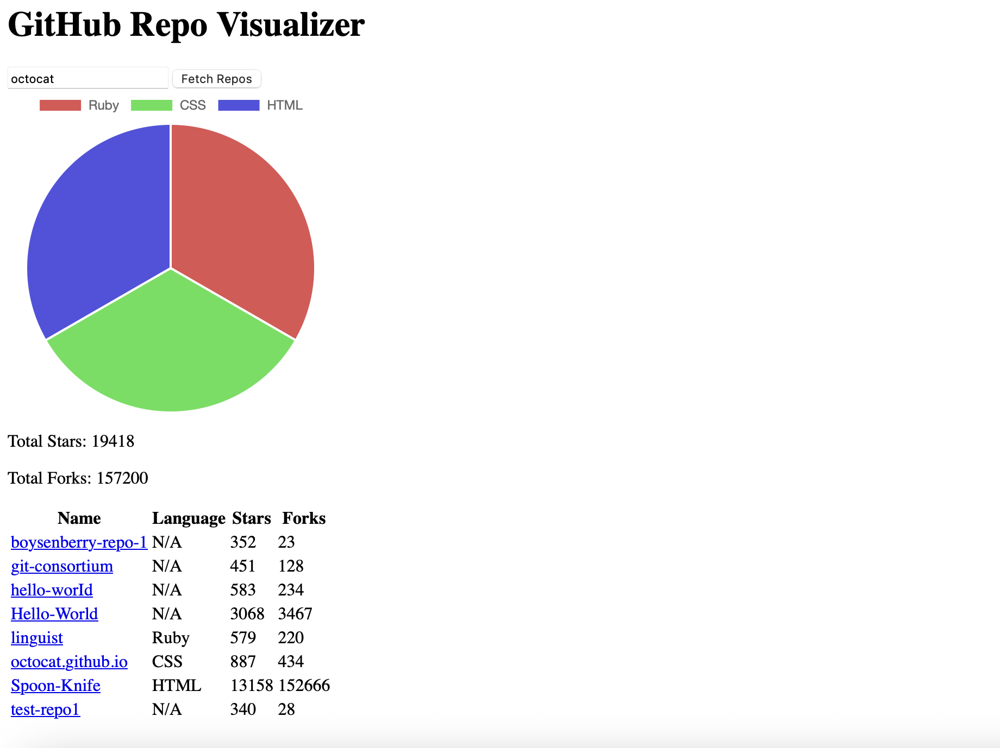

# GitHub Repo Visualizer

A simple web app to fetch and visualize GitHub repositories for any user. View repo statistics, total stars and forks, and see a pie chart of languages used.

---

## Features

- Fetch up to 100 public repositories for any GitHub user
- Display repository name, language, stars, and forks in a table
- Show total stars and forks across all repositories
- Visualize languages used with a dynamic pie chart

---

## Technologies

- HTML, CSS, JavaScript
- Chart.js for charts
- GitHub REST API

---

## Getting Started

1. Clone the repository:

```
git clone https://github.com/yourusername/github-repo-visualizer.git
cd github-repo-visualizer
```

2. Open index.html in your browser
3. Enter a GitHub username and click Fetch Repos

## Screenshots
.
.

## Usage
- The table shows repository info including name, primary language, stars, and forks
- The pie chart visualizes the count of repositories by language
- Total stars and forks are displayed at the top of the stats section
